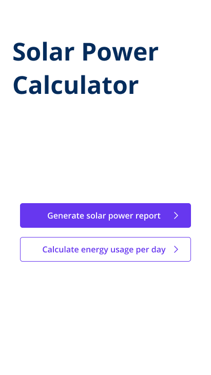
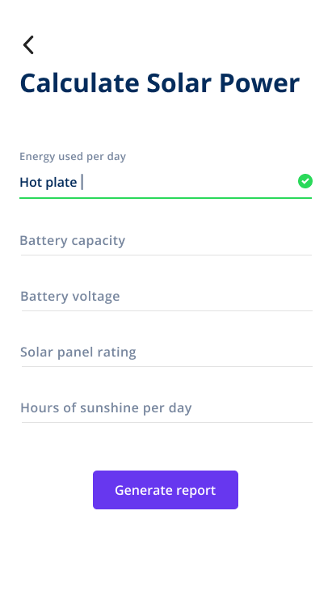

# Team-Thor
Repository for Team Thor's HNGi Tasks

Goals Tracker.
Goals Tracker web application is designed to have you up and running with your goals in no time. This guide provides an overview of the steps you should take to be on your way to success. 

Quick start.
To get started, Sign Up Once you have received your and activated your verification link, you can Log In and begin.
 

Solar power calculator.
      
  A home page displays Two options...
   1.Generate solar power report 
   2.calculate energy usage per day
      *see image below*...
      
      
      
   Calculate power consumption page
   Opens page to list gadgets and energy rating with the following input required;
   Gadget.                  
   Rating.       
   Hours per day
    Power usage Result
       *see image below*...
              
     Calculation of the needed solar power page.
   Displays a list of information required
   Energy consumption per day
   (Watts/KW)
   Battery capacity (aH)
   Battery voltage (Volts) 
   Solar panel capacity
   Hours of daily sunlight
       *see image below*...
       
 
