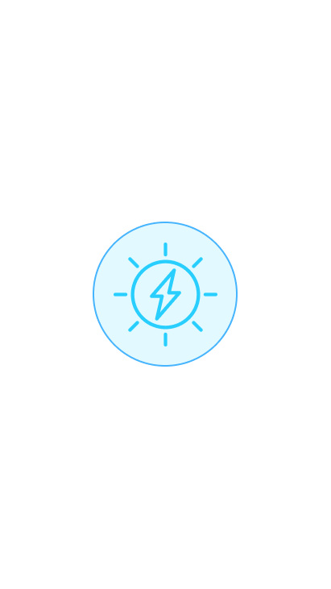
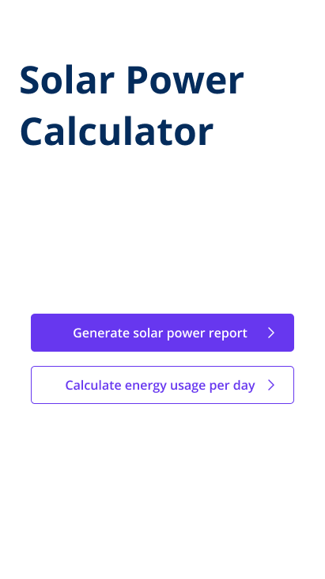
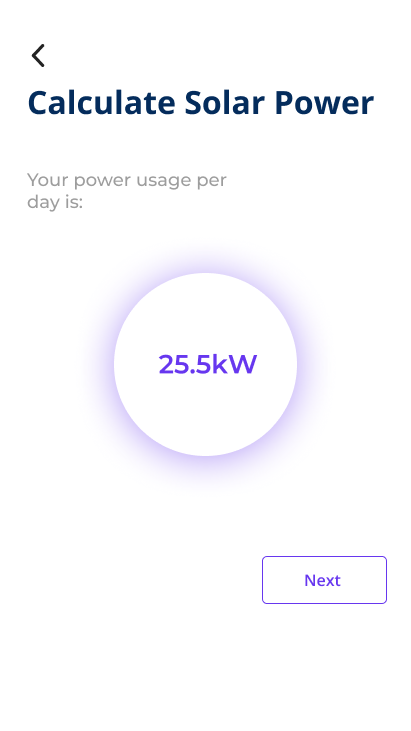
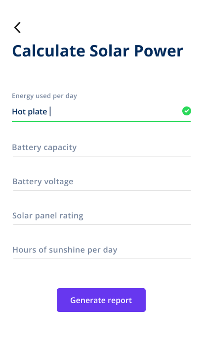
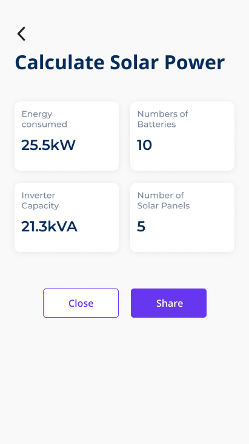

# Team-Thor
Repository for Team Thor's HNGi Tasks

Goals Tracker.
Goals Tracker web application is designed to have you up and running with your goals in no time. This guide provides an overview of the steps you should take to be on your way to success. 

Quick start.
To get started, Sign Up Once you have received your and activated your verification link, you can Log In and begin.
 

Solar power calculator.

A home page that welcomes user and has two buttons.
The two buttons on the home screen/page are 'get started' and 'learn more'

*Get started* takes user to calculation page
*Learn more* takes user to learn other useful infomation about how the app works.
   *see image below*...
   
   
  
  With tips on how to manage power consumption. E.g using energy saving light bulbs
   
   
   Calculation page displays Two options...
   1.Generate solar power report 
   
   
   
   
   2.Calculate energy usage per day
      *see image below*...
      
    
      
   Calculate power consumption page
   Opens page to list gadgets and energy rating.
   Gadget.                   Rating.        Hours per day
   ________                 ________        __________
   
         
     
        Calculate needed solar power page.
   
   
   
   Displays form
   Energy consumption per day ________ 
   (Watts/KW) ________
   Battery capacity (aH) ________
   Battery voltage (Volts)  _____
   Solar panel capacity________
   Hours of daily sunlight _______
       *see image below*...
       
       
       
 
